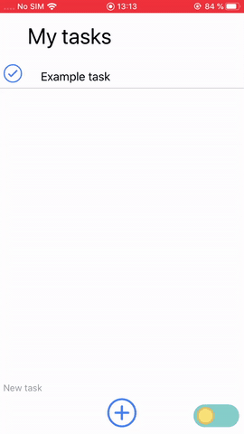

# toDoList

<h4 align="center">Application toDoList avec ⚛️React native</h4>

<p align="center">
<a href="https://badge.fury.io/js/react-native-draggable-flatlist"></a>
<a href="https://badge.fury.io/js/expo-dark-mode-switch"></a>
<a href="https://badge.fury.io/js/react-native-elements"></a>
<a href="https://badge.fury.io/js/react-native-animatable"></a>
</p>

<p align="center">
  <a href="#Fonctionnalités">Fonctionnalités</a> |
  <a href="#Utilisation">Utilisation</a> |
  <a href="#Licence">Licence</a> |
  <a href="#Contactez-moi">Contactez-moi</a> |
  <a href="https://ronanren.github.io" target="_blank">Mon site personnel</a> 
</p>

# Fonctionnalités

- [x] Add tasks
- [x] Saving the tasks in order
- [x] Changing the order of tasks
- [x] Remove tasks with a check button :ballot_box_with_check:
- [x] Button switch to dark mode :first_quarter_moon:
- [ ] Make history of removed task with a rolling list
- [ ] Edit the name and color of the tasks with a button

<p align="center">
    
</p>

# Utilisation

```bash
# Cloner ce dépôt
$ git clone https://github.com/ronanren/toDoList

# Accéder au dossier
$ cd toDoList

# Installer toutes les dépendances
$ npm install

# Lancer l'application
$ npm start
```

# Licence

MIT

# Contactez-moi

**Twitter** : <a href="https://twitter.com/Ronanren" target="_blank">@Ronanren</a>
